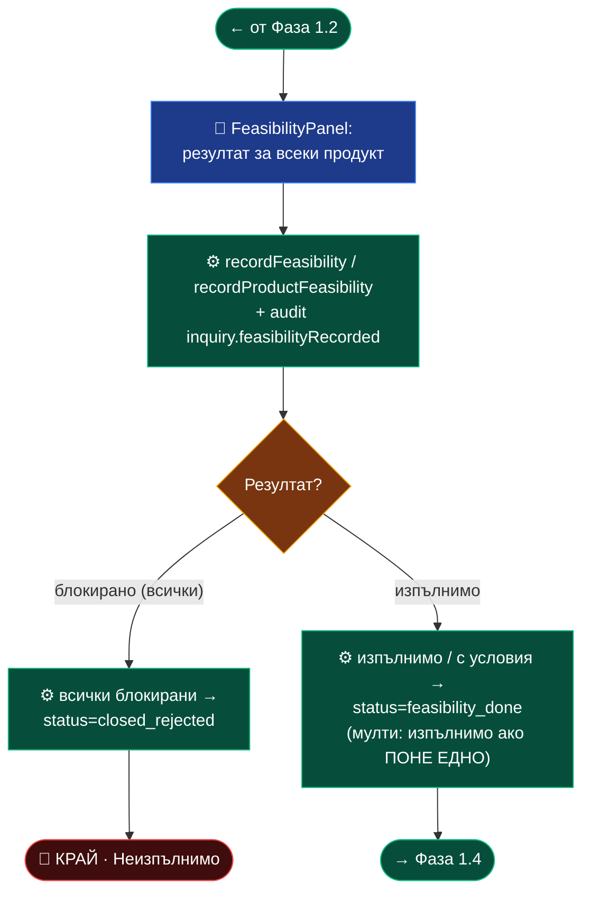
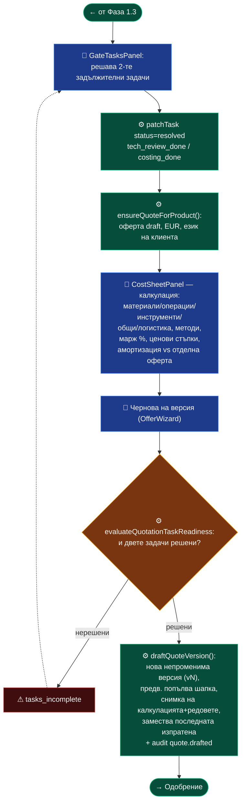
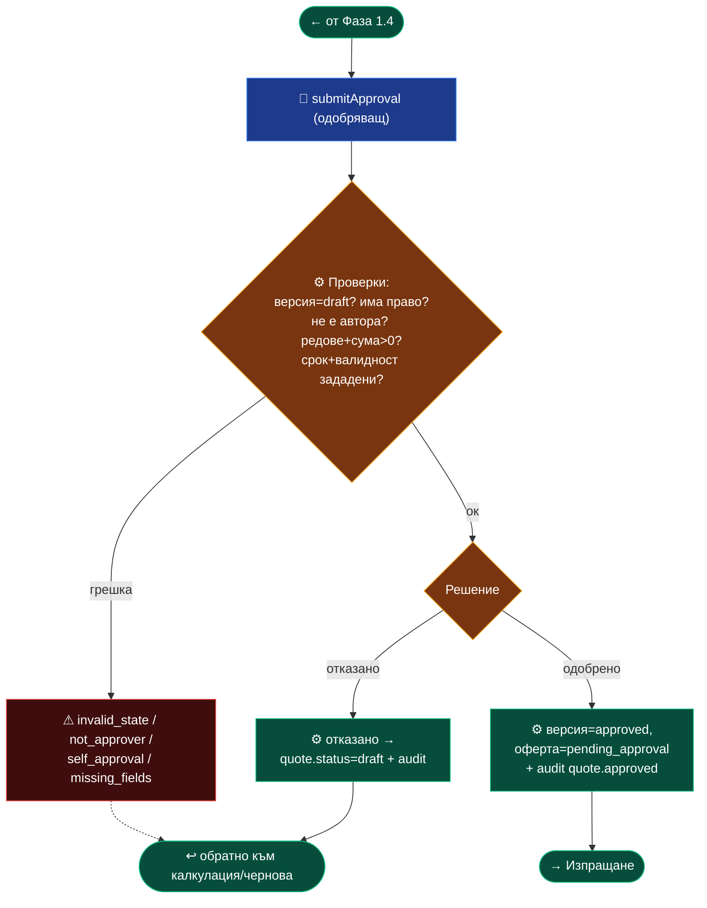
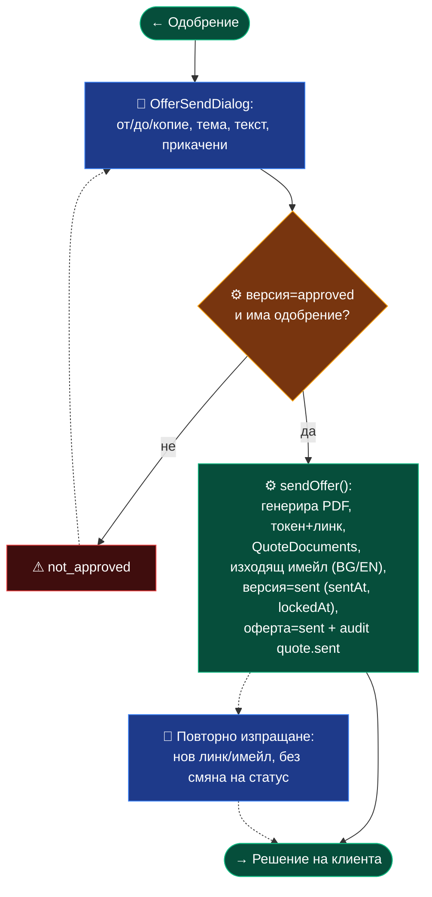
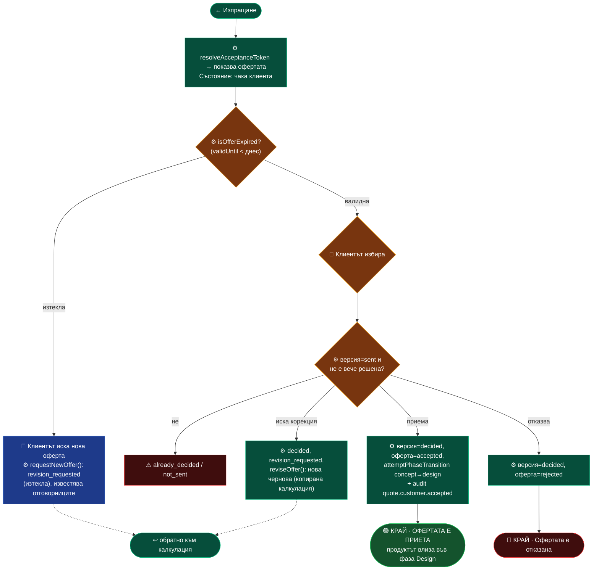

# Офериране — процес стъпка по стъпка (VSM Фаза 1)

От момента, в който се натисне **„Ново запитване"**, до **приемане на офертата от клиента**.
Разделено по фази за по-лесно вграждане. Покрива всяко действие на потребителя, всяко действие на
системата и всички сценарии (разклонения).

**Легенда** — 👤 действие на потребителя · ⚙ действие на системата/услугата · ◇ решение/проверка · 🔴 краен (отказан/затворен) · 🟢 приет.

Под-състояния (от `offerSubStateMachine.js`):
`inquiry_received → intake_complete → feasibility_done → tech_review_done → costing_done → quote_drafted → approved → sent → decided_accepted`

---

## Фаза 1.1 — Ново запитване

```mermaid
flowchart TD
    classDef user fill:#1e3a8a,stroke:#3b82f6,color:#fff;
    classDef sys fill:#064e3b,stroke:#10b981,color:#fff;
    classDef dec fill:#78350f,stroke:#f59e0b,color:#fff;
    classDef term fill:#3f0d0d,stroke:#ef4444,color:#fff;

    START(["👤 Натиска „Ново запитване""]):::user
    F1["👤 Попълва NewInquiryForm:<br/>клиент (избор/нов), продукт,<br/>канал, количества, срок,<br/>спецификация, файлове,<br/>доп. продукти, отговорници"]:::user
    F1SUB["👤 Изпраща"]:::user
    VAL{"⚙ Валидация"}:::dec
    ERRV["⚠ Грешка: липсва име/канал/<br/>клиент не е намерен"]:::term
    SVC["⚙ startNewInquiry():<br/>намира или създава клиент<br/>(+ език за комуникация)"]:::sys
    PROD["⚙ createConceptProduct():<br/>продукт draft, фаза=concept<br/>+ lifecycle + audit product.created"]:::sys
    REG["⚙ registerInquiry():<br/>чернова + изчисляване на<br/>липсващи полета + audit"]:::sys
    GATE["⚙ ensureQuotationGateTasks():<br/>автом. 2 задачи (draft, висок приоритет):<br/>тех. преглед → технолог<br/>калкулация → планов отдел"]:::sys
    EXTRA["⚙ За всеки доп. продукт:<br/>собствен продукт + собствени задачи"]:::sys
    NEXT(["→ Фаза 1.2"]):::sys

    START --> F1 --> F1SUB --> VAL
    VAL -- невалидно --> ERRV -.-> F1
    VAL -- валидно --> SVC --> PROD --> REG --> GATE --> EXTRA --> NEXT
```

---

## Фаза 1.2 — Пълнота на входните данни

```mermaid
flowchart TD
    classDef user fill:#1e3a8a,stroke:#3b82f6,color:#fff;
    classDef sys fill:#064e3b,stroke:#10b981,color:#fff;
    classDef dec fill:#78350f,stroke:#f59e0b,color:#fff;
    classDef term fill:#3f0d0d,stroke:#ef4444,color:#fff;

    IN(["← от Фаза 1.1"]):::sys
    CHK{"⚙ Няма липсващи полета?<br/>(чертежи, количество, срок,<br/>спецификация, изисквания)"}:::dec
    PENDING["Състояние: intake_pending"]:::sys
    OPEN["👤 Отваря InquiryIntakeForm,<br/>добавя данни / „без файлове""]:::user
    UPD["⚙ updateInquiry():<br/>преизчислява липсващите полета"]:::sys
    COMPLETE["⚙ status=intake_complete<br/>+ audit inquiry.intakeComplete"]:::sys
    CLOSE["👤 Затваря запитването"]:::user
    CLOSED["⚙ closeInquiryRejected():<br/>closed_rejected + audit"]:::sys
    ENDCLOSED(["🔴 КРАЙ · Запитването е затворено"]):::term
    NEXT(["→ Фаза 1.3"]):::sys

    IN --> CHK
    CHK -- "липсват полета" --> PENDING --> OPEN --> UPD --> CHK
    CHK -- "всички налични" --> COMPLETE --> NEXT
    PENDING -.-> CLOSE
    OPEN -.-> CLOSE
    CLOSE --> CLOSED --> ENDCLOSED
```

---

## Фаза 1.3 — Оценка за изпълнимост



---

## Фаза 1.4 — Задачи (гейтове), Калкулация и Чернова на оферта



---

## Одобрение (мениджърски гейт)



---

## Изпращане до клиента



---

## Решение на клиента (публична страница `/offer-accept/{token}`)


