# Offer process — end-to-end flow (VSM Phase 1)

From the moment **"New inquiry"** is clicked until the offer is **accepted by the customer**.
Covers every user step, every system/service action, and all branch scenarios.

**Legend** — 👤 user action · ⚙ system/service action · ◇ decision/guard · 🔴 terminal (rejected/closed) · 🟢 accepted.

Source files:
- Intake: `src/services/offers/newInquiryService.js`, `inquiryIntakeService.js`
- Feasibility: `src/services/offers/feasibilityService.js`
- Gate tasks: `src/services/quotations/quotationAutomationService.js`
- Versioning: `src/services/offers/quoteVersioningService.js`, `quoteCloneService.js`
- Approval: `src/services/offers/quoteApprovalService.js`
- Send: `src/services/offers/quoteSendService.js`
- Customer decision: `src/services/offers/customerDecisionService.js`
- State machine: `src/services/offers/offerSubStateMachine.js`

```mermaid
flowchart TD
    %% ============ LEGEND ============
    classDef user fill:#1e3a8a,stroke:#3b82f6,color:#fff;
    classDef sys fill:#064e3b,stroke:#10b981,color:#fff;
    classDef dec fill:#78350f,stroke:#f59e0b,color:#fff;
    classDef term fill:#3f0d0d,stroke:#ef4444,color:#fff;
    classDef good fill:#14532d,stroke:#22c55e,color:#fff;

    START(["👤 User clicks 'New inquiry'"]):::user

    %% ============ PHASE 1.1 — INTAKE FORM ============
    subgraph P11["VSM 1.1 · New Inquiry"]
        F1["👤 Fill NewInquiryForm:<br/>client (pick existing / new),<br/>product name+desc,<br/>channel, qty/quantities,<br/>deadline, spec, attachments,<br/>extra products, task assignees"]:::user
        F1SUB["👤 Submit"]:::user
        VAL{"System validates"}:::dec
        ERRV["⚠ Error: missing_product_name /<br/>missing_channel / missing_client_name /<br/>client_not_found"]:::term
        SVC["⚙ startNewInquiry():<br/>resolve or appendClient<br/>(+ patch spokenLanguage)"]:::sys
        PROD["⚙ createConceptProduct():<br/>product status=draft, phase=concept<br/>+ productLifecycleState<br/>+ audit product.created"]:::sys
        REG["⚙ registerInquiry():<br/>createInquiryDraft<br/>computeMissingIntakeFields<br/>+ audit inquiry.received"]:::sys
        GATE["⚙ ensureQuotationGateTasks():<br/>auto-create 2 tasks (status=draft, high):<br/>quote-tech-review-{pid} → engineer<br/>quote-costing-{pid} → planner"]:::sys
        EXTRA["⚙ For each extra product:<br/>own concept product + own gate tasks;<br/>+ ad-hoc tasks added in form"]:::sys
    end

    START --> F1 --> F1SUB --> VAL
    VAL -- invalid --> ERRV
    ERRV -.-> F1
    VAL -- valid --> SVC --> PROD --> REG --> GATE --> EXTRA --> INTAKECHK

    %% ============ PHASE 1.2 — INTAKE COMPLETENESS ============
    subgraph P12["VSM 1.2 · Intake completeness"]
        INTAKECHK{"⚙ missingFields empty?<br/>(drawings, quantity, deadline,<br/>specifications, customerRequirements)"}:::dec
        PENDING["State: intake_pending"]:::sys
        OPENINTAKE["👤 Open InquiryIntakeForm,<br/>add missing data / mark 'no files'"]:::user
        UPD["⚙ updateInquiry():<br/>patchInquiry + recompute missingFields"]:::sys
        COMPLETE["⚙ status=intake_complete<br/>+ audit inquiry.intakeComplete"]:::sys
        CLOSE["👤 Close inquiry (reject)"]:::user
        CLOSED["⚙ closeInquiryRejected():<br/>status=closed_rejected + audit"]:::sys
        ENDCLOSED(["🔴 END · Inquiry closed"]):::term
    end

    INTAKECHK -- "fields missing" --> PENDING --> OPENINTAKE --> UPD --> INTAKECHK
    INTAKECHK -- "all present" --> COMPLETE --> FEAS
    PENDING -.-> CLOSE
    OPENINTAKE -.-> CLOSE
    CLOSE --> CLOSED --> ENDCLOSED

    %% ============ PHASE 1.3 — FEASIBILITY ============
    subgraph P13["VSM 1.3 · Feasibility review"]
        FEAS["👤 FeasibilityPanel:<br/>record outcome per product"]:::user
        FREC["⚙ recordFeasibility / recordProductFeasibility<br/>+ audit inquiry.feasibilityRecorded"]:::sys
        FDEC{"Outcome?"}:::dec
        FBLOCK["⚙ all blocked → status=closed_rejected"]:::sys
        ENDBLOCK(["🔴 END · Not feasible"]):::term
        FOK["⚙ feasible / feasible_with_conditions<br/>→ status=feasibility_done<br/>(multi-product: feasible if ANY feasible)"]:::sys
    end

    FEAS --> FREC --> FDEC
    FDEC -- "blocked (all)" --> FBLOCK --> ENDBLOCK
    FDEC -- "feasible" --> FOK --> TASKS

    %% ============ PHASE 1.4 — GATE TASKS + COSTING ============
    subgraph P14["VSM 1.4 · Tech review · Costing · Quote draft"]
        TASKS["👤 GateTasksPanel:<br/>resolve the 2 mandatory tasks"]:::user
        TRES["⚙ patchTask status=resolved (+completedAt)<br/>tech_review_done / costing_done"]:::sys
        ENSUREQ["⚙ ensureQuoteForProduct():<br/>quote draft, currency=EUR,<br/>language=client.spokenLanguage<br/>+ audit quote.created"]:::sys
        COST["👤 CostSheetPanel — build calculation:<br/>material/operation/tooling/other/logistics,<br/>drivers (count/weight/surface/percent/<br/>allocation/pack), margin %, price breaks,<br/>tooling amortise vs separate"]:::user
        DRAFT["👤 Draft offer version (OfferWizard)"]:::user
        READY{"⚙ evaluateQuotationTaskReadiness:<br/>both gate tasks resolved?"}:::dec
        BLOCKT["⚠ tasks_incomplete<br/>(pendingKeys returned)"]:::term
        MKVER["⚙ draftQuoteVersion():<br/>new immutable QuoteVersion (vN),<br/>prefill header (contact/address/dispatch),<br/>snapshot cost sheets + line items,<br/>supersede last sent, quote.status=draft<br/>+ audit quote.drafted → quote_drafted"]:::sys
    end

    TASKS --> TRES --> ENSUREQ --> COST --> DRAFT --> READY
    READY -- "not resolved" --> BLOCKT
    BLOCKT -.-> TASKS
    READY -- "resolved" --> MKVER --> APPROVE

    %% ============ APPROVAL GATE ============
    subgraph PAP["Approval gate (manager)"]
        APPROVE["👤 submitApproval (approver)"]:::user
        ACHK{"⚙ Guards:<br/>version=draft? approver canApproveQuotes?<br/>not the author? line items + subtotal>0?<br/>leadTime + validUntil set?"}:::dec
        AERR["⚠ invalid_state / not_approver /<br/>self_approval / missing_fields"]:::term
        ADEC{"Decision"}:::dec
        AREJ["⚙ approval rejected →<br/>quote.status=draft + audit"]:::sys
        AOK["⚙ version=approved,<br/>quote=pending_approval<br/>+ audit quote.approved"]:::sys
    end

    APPROVE --> ACHK
    ACHK -- "guard fails" --> AERR
    AERR -.-> DRAFT
    ACHK -- "ok" --> ADEC
    ADEC -- "rejected" --> AREJ
    AREJ -.-> COST
    ADEC -- "approved" --> AOK --> SEND

    %% ============ SEND ============
    subgraph PSEND["Send to customer"]
        SEND["👤 OfferSendDialog: from/to/cc,<br/>subject, body, attachments"]:::user
        SCHK{"⚙ version=approved<br/>& has approved approval?"}:::dec
        SERR["⚠ not_approved"]:::term
        SOUT["⚙ sendOffer():<br/>buildOfferPdfBlob, generate token+link,<br/>QuoteDocuments (acceptance_receipt + PDF),<br/>appendOutboundEmail (EN/BG body),<br/>version=sent (sentAt, lockedAt),<br/>quote=sent + audit quote.sent → sent"]:::sys
        RESEND["👤 Re-send (already sent):<br/>new link/email, no state change<br/>+ audit quote.resent"]:::user
    end

    SEND --> SCHK
    SCHK -- "no" --> SERR
    SERR -.-> APPROVE
    SCHK -- "yes" --> SOUT --> WAIT
    SOUT -.-> RESEND
    RESEND -.-> WAIT

    %% ============ CUSTOMER DECISION (public page) ============
    subgraph PCUST["Customer · public acceptance page /offer-accept/{token}"]
        WAIT["⚙ resolveAcceptanceToken → render offer<br/>State: awaiting customer"]:::sys
        EXP{"⚙ isOfferExpired?<br/>(validUntil < today)"}:::dec
        REQNEW["👤 Customer requests new offer<br/>⚙ requestNewOffer(): decision=revision_requested<br/>(reason=expired), quote=revision_requested,<br/>notify offer owners"]:::user
        CDEC{"👤 Customer chooses"}:::dec
        DGUARD{"⚙ version=sent & not already decided?"}:::dec
        DERR["⚠ already_decided / not_sent"]:::term
        ACC["⚙ version=decided, quote=accepted,<br/>attemptPhaseTransition concept→design<br/>+ audit quote.customer.accepted"]:::sys
        REV["⚙ version=decided, quote=revision_requested,<br/>reviseOffer(): new draft version (calc copied)<br/>+ audit quote.customer.revision_requested"]:::sys
        REJ["⚙ version=decided, quote=rejected<br/>+ audit quote.customer.rejected"]:::sys
        ENDACC(["🟢 END · OFFER ACCEPTED<br/>product enters Design phase"]):::good
        ENDREJ(["🔴 END · Offer rejected"]):::term
    end

    WAIT --> EXP
    EXP -- "expired" --> REQNEW
    REQNEW -.-> COST
    EXP -- "valid" --> CDEC
    CDEC --> DGUARD
    DGUARD -- "no" --> DERR
    DGUARD -- "accept" --> ACC --> ENDACC
    DGUARD -- "request revision" --> REV
    REV -.-> COST
    DGUARD -- "reject" --> REJ --> ENDREJ
```

## Offer sub-state order (`offerSubStateMachine.js`)

`inquiry_received → intake_complete → feasibility_done → tech_review_done → costing_done → quote_drafted → approved → sent → decided_accepted`

Each step is **derived from the DB snapshot** (never stored separately). `canAdvanceTo()` blocks any
action whose prerequisite steps are not yet satisfied.
