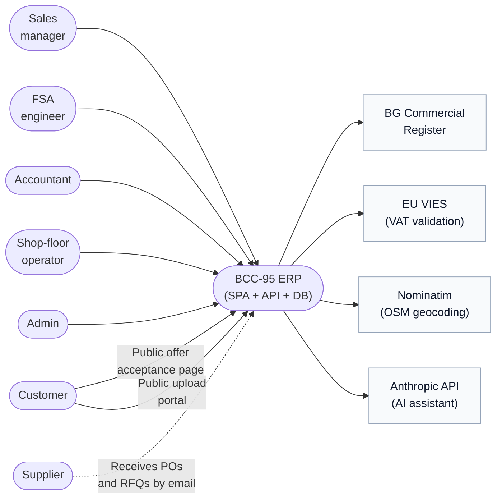
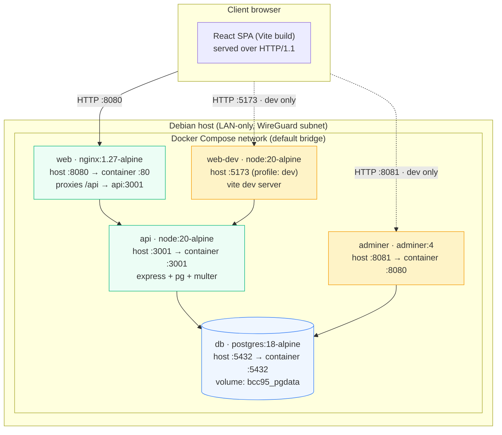
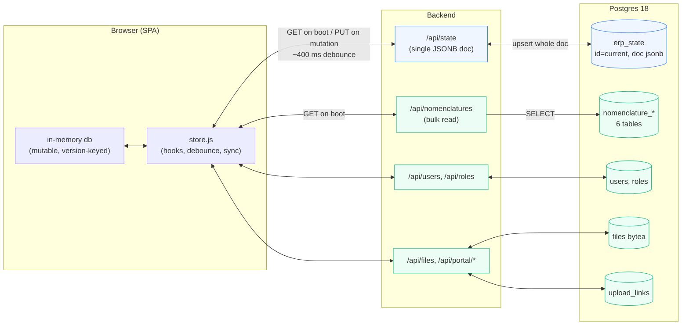
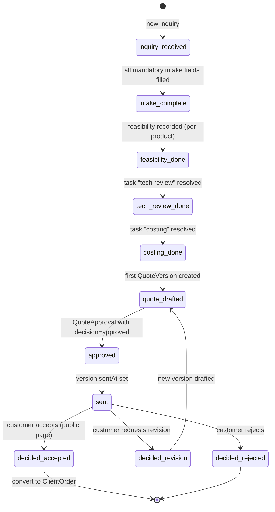
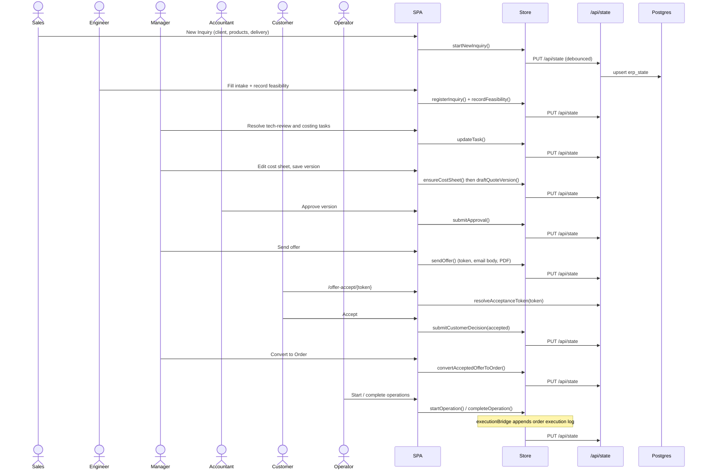
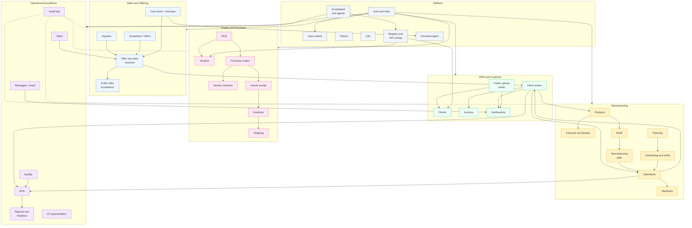
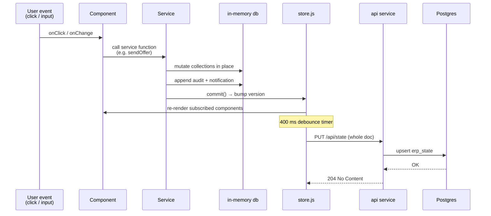

# BCC-95 Manufacturing ERP — Technical Architecture

| | |
|---|---|
| **Document version** | 1.0 |
| **Last updated** | 2026-07-14 |
| **Applies to branch** | `feature/grouped-costing` |
| **Owner** | Simonsky Solutions |

---

## Table of contents

1. [Executive summary](#1-executive-summary)
2. [System context](#2-system-context)
3. [Runtime topology](#3-runtime-topology)
4. [Dependencies](#4-dependencies)
   - 4.1 [Frontend runtime](#41-frontend-runtime)
   - 4.2 [Frontend tooling](#42-frontend-tooling)
   - 4.3 [Backend runtime](#43-backend-runtime)
   - 4.4 [Infrastructure images](#44-infrastructure-images)
   - 4.5 [External services](#45-external-services)
   - 4.6 [Deliberate non-choices](#46-deliberate-non-choices)
5. [Frontend architecture](#5-frontend-architecture)
   - 5.1 [Layered layout](#51-layered-layout)
   - 5.2 [Domains](#52-domains)
   - 5.3 [Services](#53-services)
   - 5.4 [UI shell and pages](#54-ui-shell-and-pages)
   - 5.5 [Auth and permissions](#55-auth-and-permissions)
   - 5.6 [Internationalisation](#56-internationalisation)
   - 5.7 [Domain-specific utilities](#57-domain-specific-utilities)
6. [Backend architecture](#6-backend-architecture)
7. [Data layer](#7-data-layer)
8. [Offer sub-state machine](#8-offer-sub-state-machine)
9. [End-to-end flow: inquiry → order](#9-end-to-end-flow-inquiry--order)
10. [Module map](#10-module-map)
11. [Request lifecycle](#11-request-lifecycle)
12. [Permission model](#12-permission-model)
13. [Development and operations](#13-development-and-operations)
14. [Where to look when…](#14-where-to-look-when)
15. [Roadmap](#15-roadmap)
16. [Glossary](#16-glossary)

---

## 1. Executive summary

BCC-95 is a **product-centric, domain-driven manufacturing ERP** for BCC. It ships as a single React SPA served by nginx, backed by a small Node/Express API and a Postgres database, all packaged as five Docker services orchestrated by `docker-compose`.

**Design pillars**

| # | Pillar | Consequence |
|---|---|---|
| 1 | **Product is the anchor** | Every process (inquiry, offer, planning, production, shipping, complaint) attaches to a `Product` and its lifecycle phase. |
| 2 | **Gate-driven workflows** | The offer workflow is a pure derivation from the database via an 11-state sub-state machine. Nothing advances without the prior gate being satisfied. |
| 3 | **Single-document working data** | The entire operational dataset (~300 KB JSON) is persisted as one JSONB row and rewritten on every mutation with a 400 ms debounce. Trades granular relational modelling for iteration speed. |
| 4 | **Relational master data** | Users, roles, files, upload-portal tokens, and nomenclatures live in real tables and survive `factory-reset`. |
| 5 | **Bilingual everywhere** | Full EN + BG support in the UI and in outbound documents (offers, POs, emails). |
| 6 | **LAN-only production** | Deployed inside a WireGuard subnet on a Debian host. No public exposure, no TLS termination on the box. |
| 7 | **Stable UI shell** | Sidebar, header, and product workspace never change when new modules are added — modules slot in beneath existing domains. |

**Scope of this release (`feature/grouped-costing`)**

Backend API, Purchase, CRM, Dashboard widgets, Notifications, Auth + role permissions, Theme + branding, AI assistant scaffolding, public upload portal, formula and registry utilities, and the docs you are reading.

---

## 2. System context

The context diagram shows who uses BCC-95 and what it talks to.



**Boundaries**

- **Inside the trust boundary.** The Debian host, the WireGuard subnet, and all internal users. All authentication happens by "acting as" a user (no passwords), because the network already guarantees who can reach the API.
- **Public entry points.** Two, both scoped by opaque single-purpose tokens:
  - `/offer-accept/{token}` — customer accepts, rejects, or requests revision of an offer.
  - `/upload/{token}` — customer uploads files into a designated client folder.
- **Outbound only.** External services are called from the backend to keep credentials off the browser and to bypass CORS.

---

## 3. Runtime topology



**Docker Compose services**

| Service | Image | Host port | Role | Compose profile |
|---|---|---|---|---|
| `web` | built from `Dockerfile` (nginx:1.27-alpine + built SPA) | `8080 → 80` | Serves the SPA, reverse-proxies `/api` to `api` | default |
| `web-dev` | `node:20-alpine` | `5173 → 5173` | Vite HMR dev server with source mounted | `dev` |
| `api` | `node:20-alpine` (runs `server/index.js`) | `3001 → 3001` | Express API, connects to `db` | default |
| `db` | `postgres:18-alpine` | `5432 → 5432` | Postgres, data in `bcc95_pgdata` volume | default |
| `adminer` | `adminer:4` | `8081 → 8080` | Web SQL client for the developer | default |

**Environment (api service)**

| Variable | Default | Purpose |
|---|---|---|
| `PGHOST` | `db` | Postgres host inside the compose network |
| `PGUSER` | `bcc95` | Postgres role |
| `PGPASSWORD` | `bcc95` | Password. Fine for LAN-only; override via `.env` if exposed |
| `PGDATABASE` | `bcc95` | Database name |

**Networking**

- The SPA only ever calls **same-origin URLs** (`/api/…`), so we do not have to configure CORS.
- `nginx.conf` sets `client_max_body_size 30m` to accommodate customer document uploads.
- Hashed assets under `/assets/` are served with `Cache-Control: public, immutable, max-age=31536000`; the HTML shell is not cached.

---

## 4. Dependencies

All version constraints are pinned in `package.json` (frontend) and `server/package.json` (backend). Ranges use caret prefixes; the exact resolved versions are in the corresponding `package-lock.json` files.

### 4.1 Frontend runtime

Runtime dependencies shipped in the browser bundle.

| Package | Version | Purpose | Why we use it |
|---|---|---|---|
| `react` | ^19.2.4 | UI framework | Concurrent rendering, mature ecosystem, hooks API. |
| `react-dom` | ^19.2.4 | React DOM renderer | Required by React for the browser. |
| `@xyflow/react` | ^12.10.2 | Interactive graph / flow editor | Renders the VSM diagrams and workflow visualisations inside the app. |
| `lucide-react` | ^1.8.0 | Icon set | Tree-shakable SVG icons, one consistent visual language. |
| `recharts` | ^3.8.1 | Charts | Composable React chart primitives for analytics — no D3 boilerplate. |
| `leaflet` | ^1.9.4 | Map rendering | Open, license-friendly maps for client and vendor addresses. |
| `jspdf` | ^4.2.1 | PDF generation (client) | Generates offer / PO PDFs in the browser — keeps the backend lean and lets us preview locally. |
| `jspdf-autotable` | ^5.0.7 | Table plugin for jsPDF | Renders line-item tables in offer / PO documents. |
| `xlsx` (SheetJS) | ^0.18.5 | Excel read/write | Report exports and cost / nomenclature workbook imports. |

### 4.2 Frontend tooling

Development-only dependencies. Not shipped to the browser.

| Package | Version | Purpose |
|---|---|---|
| `vite` | ^8.0.4 | Build tool, dev server, HMR |
| `@vitejs/plugin-react` | ^6.0.1 | React fast-refresh plugin for Vite |
| `tailwindcss` | ^3.4.19 | Utility-first CSS framework |
| `postcss` | ^8.5.9 | CSS transformation pipeline (required by Tailwind) |
| `autoprefixer` | ^10.4.27 | Adds vendor prefixes automatically (required by Tailwind) |
| `eslint` | ^9.39.4 | JavaScript linter |
| `@eslint/js` | ^9.39.4 | Baseline ESLint recommended config |
| `eslint-plugin-react-hooks` | ^7.0.1 | Enforces the rules of hooks |
| `eslint-plugin-react-refresh` | ^0.5.2 | Enforces HMR-safe component exports |
| `globals` | ^17.4.0 | Global variable definitions consumed by ESLint |
| `@types/react` | ^19.2.14 | Type definitions for editor IntelliSense (we do not compile TypeScript) |
| `@types/react-dom` | ^19.2.3 | Type definitions for `react-dom` |

### 4.3 Backend runtime

Runtime dependencies used by `server/index.js`.

| Package | Version | Purpose | Why we use it |
|---|---|---|---|
| `express` | ^4.21.2 | HTTP server framework | Minimal, well-known, no ceremony. |
| `pg` | ^8.13.1 | PostgreSQL client | Parameterised raw queries — no ORM overhead, transparent schema. |
| `multer` | ^2.2.0 | Multipart form parsing | Handles file uploads for the internal file store and the customer upload portal. |

The backend uses **no ORM** and **no migration framework**. Schema creation is idempotent on startup and lives directly in `server/index.js`.

### 4.4 Infrastructure images

Pinned Docker image tags used by `docker-compose.yml` and `Dockerfile`.

| Image | Tag | Used by | Purpose |
|---|---|---|---|
| `node` | `20-alpine` | `api`, `web-dev`, build stage of `web` | Node.js runtime for the API and the SPA build |
| `nginx` | `1.27-alpine` | `web` (final stage) | Static asset serving + `/api` reverse proxy |
| `postgres` | `18-alpine` | `db` | Relational database with JSONB support |
| `adminer` | `4` | `adminer` | Web-based SQL client |

### 4.5 External services

Called only from the backend so that credentials and browser CORS constraints stay off the client.

| Service | Endpoint | Route in our API | Purpose |
|---|---|---|---|
| **BG Commercial Register** | public register | `GET /api/registry/search` | Look up Bulgarian companies by name; supports Cyrillic ↔ Latin transliteration. |
| **EU VIES** | VAT validation web service | `GET /api/registry/lookup` | Validate VAT / ЕИК numbers and retrieve the registered name and address. |
| **Nominatim (OpenStreetMap)** | tile server / geocoder | `GET /api/registry/geocode` | Address → lat/lon for the Leaflet map. |
| **Anthropic API** | Claude API | `POST /api/ai/{extract-inquiry,translate,chat}` | AI assistant, translation, and inquiry OCR. |

All external calls are proxied; the frontend never sees an external hostname.

### 4.6 Deliberate non-choices

Documented so nobody re-litigates them without cause.

| Not used | Why not |
|---|---|
| ORM (Prisma / Sequelize / TypeORM) | Schema is intentionally tiny (JSONB + a handful of relational tables). ORM maintenance cost outweighs the convenience. |
| Global state library (Redux / Zustand) | A single mutable `db` object with version-keyed subscriptions is sufficient because every mutation is coordinated by services. |
| Client router (React Router) | A state-driven route object (`{ page, productId, clientId, machineId, quoteId }`) is enough and keeps deep links simple. |
| Server-side rendering | The backend only serves JSON; all rendering happens in the browser. |
| Message queue / worker | Every effect is triggered by an HTTP call. We will add a worker only when we need scheduled work. |
| TypeScript compilation | JSDoc typedefs on domain models give us structural documentation and editor IntelliSense without a build-step tax. |
| Migration framework | Schema creation is idempotent on startup; when we introduce a change we bump `SCHEMA_VERSION` and rebuild fresh. Working data can always be re-derived from the seed + user input. |

---

## 5. Frontend architecture

### 5.1 Layered layout

```
src/
├── data/       # store + hydration
├── domains/    # per-domain data models, selectors, mutations
├── services/   # cross-domain workflows
├── components/ # reusable UI (shell + domain widgets + primitives)
├── pages/      # top-level route views
├── config/     # nav, factory config
├── auth/       # current user, roles, permissions
├── i18n/       # translations + language provider
├── theme/      # light/dark provider
└── lib/        # small utilities (formula, registry, money)
```

**Rule of thumb**

- **Domains** own data and encapsulate every mutation to a single collection.
- **Services** own workflows that span multiple domains.
- **Pages** own layout.
- **Components** own presentation.

If a mutation edits a single collection it belongs in `domains/*/mutations.js`. If it spans several — for example *send offer* writes to `quotations`, `communications`, `audit`, and `notifications` — it belongs in `services/`.

### 5.2 Domains

Each domain follows the same shape: `model.js` (JSDoc typedefs) · `selectors.js` · `mutations.js` · `mockData.js` · `index.js` barrel.

| Domain | Key entities | Notes |
|---|---|---|
| `products` | `Product` | Central anchor for the lifecycle |
| `lifecycle` | `ProductLifecycleState` | Phase, gates, completion % |
| `inquiries` | `Inquiry` | Entry point of the offer workflow |
| `quotations` | `QuoteDraft`, `QuoteVersion` (immutable), `QuoteApproval`, `QuoteDecision` | Versioned offers |
| `costing` | Standard cost seed | Feeds cost sheets |
| `crm` | `Client`, `ClientContact`, `ClientAddress`, `ClientOrder`, `OrderExecutionRecord`, `OrderMachineUsage`, `OrderTimeLog`, `Invoice`, `PaymentRecord` | Full customer lifecycle |
| `purchase` | `Vendor`, `Material`, `PurchaseOrder`, `GoodsReceipt`, `VendorInvoice`, `VendorContract` | New in this release |
| `operations` | `Operation` | Shop-floor unit of work |
| `machines` | `Machine` | Equipment registry |
| `tasks` | `Task` (workstream: `quotation` / `planning` / `quality`) | Named, gate-relevant |
| `manufacturing-path` | `PathTemplate`, `ProductPathLink`, `bomOperations` | Reusable routes |
| `bom` | `BomHeader`, `BomLine`, `BomOperation` | Hierarchical BOM |
| `planning` | `Plan` | Capacity horizon |
| `scheduling` | `ShiftTemplate`, `ShiftAssignment`, `StationAssignment` | Planned vs actual |
| `shifts` | `ShiftTemplate` | Labour blocks |
| `inventory` | `StockLocation`, `StockQuant`, `StockMove` | Warehouse |
| `shipping` | `Shipment` | Outbound |
| `people` | `employees` (loaded from `users` table) | Reference data |
| `communications` | `outboundEmails`, `inquiryMessages` | Threaded conversations |
| `audit` | `auditEntries` | Change log |
| `kpis` | `kpiTargets`, `qualityIncidents` | Dashboard input |
| `iot` | `telemetrySamples` | Placeholder for Release 4 |
| `notifications` | `notifications` | New — header bell |

### 5.3 Services

Services are pure orchestration. They accept `db` and payload, mutate in place, and (where relevant) append audit entries and notifications.

**`services/offers/`** — the offer workflow.

| File | Responsibility |
|---|---|
| `offerSubStateMachine.js` | Pure derivation of workflow state from `db` snapshots. |
| `newInquiryService.js` · `inquiryIntakeService.js` | Create inquiries; mark intake complete. |
| `feasibilityService.js` | Record feasibility per product. |
| `costSheetService.js` | Create and mutate cost sheets; seed starter lines; produce price-break matrices. |
| `quoteVersioningService.js` | Draft, snapshot, and replace line items; versions are immutable once sent. |
| `quoteApprovalService.js` | Submit approvals; gate the send action. |
| `quoteSendService.js` | Mark sent, generate the acceptance token, format the bilingual email. |
| `offerDocumentService.js` | Build printable HTML / PDF offers. |
| `customerDecisionService.js` | Resolve tokens on the public page; record accept / revise / reject; guard against double-submits. |
| `quoteCloneService.js` | Clone quotes to other clients and produce revisions. |
| `toolingOfferService.js` | Separate tooling / amortisation quotes. |
| `orderHandoffService.js` | Convert accepted offers into `ClientOrder`. |

**Other services**

| Path | Responsibility |
|---|---|
| `services/manufacturing/executionBridge.js` | Couples `Operation` start / complete to `ClientOrder` execution records, machine usage, and time logs. |
| `services/purchase/poDocumentService.js` | Bilingual printable purchase orders. |
| `services/quotations/quotationAutomationService.js` | Auto-creates the mandatory quotation tasks (tech review, costing) that gate the offer workflow. |
| `services/reporting/reportService.js` · `exportService.js` | Filterable reports plus Excel / PDF / CSV exports. |
| `services/lifecycle/phaseTransitionService.js` | Gate product-phase changes; write to `lifecycle` and `audit`. |
| `services/kpis/kpiCalculator.js` | Pure functions that compute delivery, quality, productivity, and process KPIs. |
| `services/ai/agentOrchestratorService.js` · `erpQueryContext.js` | Build a facts block for the LLM (with fuzzy Cyrillic ↔ Latin client matching) and orchestrate multi-turn tool use. |

### 5.4 UI shell and pages

The shell is deliberately stable — new modules do not modify it.

| Component | Role |
|---|---|
| `App.jsx` | State-driven router. Lazy-loads every page. Handles public routes (`/offer-accept/:token`, `/upload/:token`) outside the sidebar shell. |
| `main.jsx` | Provider nesting: `Theme → FactoryConfig → Language → CurrentUser → Feedback`. |
| `config/erpNav.js` | 19-item sidebar. Each item maps to a page and a permission. |
| `Sidebar.jsx` | Collapsible navigation panel. |
| `Header.jsx` | Title, ⌘K search, language switch, theme toggle, AI panel toggle, user switcher, notification bell. |
| `CommandPalette.jsx` | ⌘K search across products, clients, offers. |
| `ChatLauncher.jsx` | Floating 1:1 team chat. |
| `AiAssistantPanel.jsx` | Collapsible right sidebar tied to the current page context. |
| `NotificationBell.jsx` | Dropdown with unread badge, driven by `domains/notifications`. |
| `components/ui/Feedback.jsx` | Global toast provider. |

**Pages (25 total)**

Selected highlights — full list in [`docs/all-modules-bg.md`](./all-modules-bg.md).

| Page | Purpose |
|---|---|
| `DashboardPage` | KPI cards, offer pipeline, ActionCenter, floating "new inquiry" FAB. |
| `ProductsPage` · `ProductWorkspacePage` | Product list and deep-edit workspace with BOM, operations, path, tasks. |
| `QuotationsPage` · `OfferWorkspacePage` | Offer list and full editor: inquiry, cost sheet, approvals, versioning, send, preview. |
| `PurchasePage` | Tabs for Vendors, RFQ, Orders (with `OrdersBoard` Kanban), Contracts, Compare. |
| `ManufacturingPage` | Shop-floor view: open operations with start / complete actions. |
| `CRMPage` · `ClientProfilePage` | Client list and full profile (orders, invoices, execution log, upload-portal link management). |
| `AnalyticsPage` · `ReportsPage` | Charts (Recharts) and tabular reports with Excel / PDF / CSV export. |
| `SettingsPage` | Factory config, cost drivers, custom methods (formulas), theme, users, roles. |
| `public/OfferAcceptancePage` | Token-scoped customer decision page. |
| `public/UploadPortalPage` | Token-scoped customer file uploader. |

### 5.5 Auth and permissions

- No passwords. A **current user switcher** in the header selects who you act as; the selection persists in `localStorage`.
- Users load from the relational `users` table and map into `db.employees`.
- Every action asks `can('some.permission')`. Effective permissions = role permissions ∪ user overrides.
- Built-in roles: **Admin**, **Manager**, **Mechanic**, **Logistics**, **Marketing**, **Accountant**. Custom roles can be defined in Settings.
- Sidebar visibility is filtered by both `config.enabledModules` and `can('module.xyz')`.

This is by design for a trusted-LAN deployment. When we need real authentication we will add it as a **login gate in front of the SPA** (nginx basic auth or a small OIDC layer) without touching the domain layer.

### 5.6 Internationalisation

Every string comes from `src/i18n/translations.js` via `useLanguage().t('key')`. English and Bulgarian are complete. Outbound documents (offer PDFs, PO PDFs, offer emails) are also bilingual — the recipient's preferred language is stored on the client record.

### 5.7 Domain-specific utilities

| File | Purpose |
|---|---|
| `src/lib/formula.js` | Tokeniser + recursive-descent evaluator for arithmetic expressions such as `qty * rate * surface_factor`. No `eval`; unknown variables collapse to 0. Powers `CustomMethodsEditor.jsx` so admins can define new cost calculations without a code change. |
| `src/lib/registry.js` | VIES / BG Commercial Register / Nominatim client with Cyrillic ↔ Latin transliteration so a search for *Гетов* also finds *Getov*. |
| `src/lib/money.js` | Currency formatting helpers. |

---

## 6. Backend architecture

A single ~1,100-line Express application. Grouped by concern:

| Concern | Endpoints |
|---|---|
| **Working data** | `GET /api/state` · `PUT /api/state` · `POST /api/factory-reset` |
| **Master data** | `GET /api/nomenclatures` |
| **Users & roles** | `GET/POST/PATCH/DELETE /api/users` · `GET/PATCH /api/roles` |
| **Files** | `GET/POST/PUT/DELETE /api/files` |
| **Public upload portal** | `POST /api/clients/:clientId/upload-link` · `GET /api/clients/:clientId/upload-link` · `POST /api/upload-links/:token/revoke` · `GET /api/portal/:token` · `POST /api/portal/:token/files` · `GET /api/portal/:token/files` |
| **AI** | `POST /api/ai/extract-inquiry` · `POST /api/ai/translate` · `POST /api/ai/chat` · `GET /api/ai/status` |
| **External registry** | `GET /api/registry/search` · `GET /api/registry/lookup` · `GET /api/registry/geocode` |
| **Health** | `GET /api/health` |

**Idempotent bootstrap**

On startup the API creates every table if it is missing, seeds built-in roles, ensures an Admin user exists, and applies additive role migrations (for example, adding `users.manage` to the Manager role if it was absent). Re-running is always safe.

**Queries**

Every SQL call is a parameterised `pg` query. There is no ORM, no query builder, and no migration framework. Schema is defined once, in code, at startup.

---

## 7. Data layer

BCC-95 uses **two different persistence strategies** side by side. Getting the distinction right is the single most important thing to understand.



**Working data — single JSONB document.** All operational records (products, quotes, tasks, orders, operations, notifications, audit entries) live in one row of `erp_state`. Every mutation triggers a debounced 400 ms `PUT /api/state` that upserts the whole document. Deliberate trade-off: simplicity and atomicity in exchange for the ability to query in SQL. Working data can be re-derived from the seed and user input, so we do not run migrations against it — we bump `SCHEMA_VERSION` and rebuild.

**Master data — relational tables.** Nomenclatures, users, roles, files, and upload-portal tokens live in real tables and are queryable from SQL. They survive `factory-reset` because they represent long-lived configuration and identity, not operational state.

**Relational tables**

| Table | Purpose |
|---|---|
| `erp_state` | The single JSONB working document (`id='current'`, `doc jsonb`, `updated_at`) |
| `nomenclature_suppliers` | Vendors from the master workbook |
| `nomenclature_materials` | Material catalog with defaults |
| `nomenclature_operations` | Operation catalog (labour and machine) |
| `nomenclature_tools` | Tool and fixture catalog |
| `nomenclature_overheads` | Overhead cost catalog |
| `nomenclature_logistics` | Logistics cost catalog |
| `roles` | Built-in and custom roles with permission arrays |
| `users` | User accounts with role FK and `custom_permissions` overrides |
| `files` | Binary uploads (`bytea`) with `source`, `folder`, `client_id`, `product_id` metadata |
| `upload_links` | Public token → `client_id` mapping for the customer upload portal |

**Frontend store (`src/data/store.js`)**

- Wraps a mutable `db` object; every mutation happens in place and bumps a version counter.
- Components subscribe via `useDb()`. Re-renders are triggered by the version change.
- `SCHEMA_VERSION` is bumped whenever the seed shape changes; stale documents are discarded on load rather than migrated.
- After boot, `syncAllCounters()` walks every collection and re-seeds domain ID counters so subsequent inserts cannot collide with existing IDs.

---

## 8. Offer sub-state machine

The offer workflow is a **pure derivation** from the database. There is no local status field to keep in sync; every call to `computeOfferProgress(db, productId)` re-evaluates from snapshots.



**Guarantees**

- `canAdvanceTo(progress, target)` returns `{ ok, reason }`. Every gate has an explicit reason string (`intake:missingFields`, `task:quotation-tech-review`, `quote:no_version`, `customer:pending`, …) so the UI can show operators exactly what is blocking progress.
- `submitCustomerDecision` on an already-decided token returns `already_decided` rather than overwriting; every write is safe to retry.

---

## 9. End-to-end flow: inquiry → order



Every step is a coordinated mutation in a service that reads from and writes to `db`; the store handles the debounced persistence. No page ever touches the database directly.

---

## 10. Module map

Modules in the same cluster share a data neighbourhood; arrows show the most important dependencies. Every cluster writes into the audit trail and is gated by Auth.



---

## 11. Request lifecycle

What actually happens when the user clicks something.



**Failure handling**

- Every mutation happens **synchronously in memory**, so the UI never waits for the network.
- If the debounced `PUT` fails, the store retries with exponential back-off; the local state remains authoritative until the write succeeds.
- Because writes are whole-document upserts, the retry payload is always internally consistent — there is no partial-write recovery to reason about.

---

## 12. Permission model

Effective permissions are the **union** of role permissions and per-user overrides.

```mermaid
flowchart LR
  User[users row]
  Role[roles row]
  Custom[user.custom_permissions]
  Effective["effective permissions<br/>= role.permissions ∪ user.custom_permissions"]
  Can["can('module.quotations')<br/>can('offer.approve')<br/>can('users.manage')<br/>…"]

  User -->|role_id FK| Role
  Role -->|role.permissions[]| Effective
  User -->|user.custom_permissions[]| Effective
  Custom --> Effective
  Effective --> Can

  Can -->|filters| Sidebar[Sidebar visibility]
  Can -->|gates| Actions[Action buttons]
  Can -->|gates| PageAccess[Page access]
```

Permission strings are namespaced (`module.<name>`, `offer.<verb>`, `users.<verb>`) so we can grep for every enforcement point.

---

## 13. Development and operations

### Local development

```bash
# Production-style stack (nginx-served SPA + api + db)
docker compose up --build

# Hot-reload SPA with the api + db running behind it
docker compose --profile dev up web-dev api db

# Just the database + Adminer (browse SQL directly)
docker compose up db adminer
```

| URL | What |
|---|---|
| `http://localhost:8080` | Production-style SPA (from the `web` service) |
| `http://localhost:5173` | Vite dev SPA (from the `web-dev` service) |
| `http://localhost:3001/api/health` | Backend health check |
| `http://localhost:8081` | Adminer — server: `db`, user/password/db: `bcc95` |

### NPM scripts (frontend)

| Script | Purpose |
|---|---|
| `npm run dev` | Start Vite dev server on `:5173` |
| `npm run build` | Production build into `dist/` |
| `npm run preview` | Preview the production build locally |
| `npm run lint` | ESLint over the source tree |
| `npm run validate` | Functional checks on selectors and services (see `scripts/validate-erp.mjs`) |

### Data lifecycle

- **Fresh install** — the SPA boots from `createEmptyDatabase()` and hydrates from `GET /api/state`. If there is no document yet, the app runs on an empty dataset.
- **Factory reset** — `POST /api/factory-reset` deletes the `erp_state` row. Nomenclatures, users, roles, and files are untouched.
- **Schema evolution** — bump `SCHEMA_VERSION` in `src/data/store.js`. Stale documents are discarded on load; production would take a fresh snapshot before that.

### Observability

- Backend logs are stdout / stderr from the `api` container.
- Postgres logs are stdout from the `db` container.
- No metrics endpoint yet; when we add one the natural home is `GET /api/metrics` on the api service.

### Backup

- `docker exec bcc95-db-1 pg_dump -U bcc95 bcc95 > backup.sql` on the host, cronned.
- The `bcc95_pgdata` named volume is the single source of truth for durable state.

---

## 14. Where to look when…

| Task | Start here |
|---|---|
| Add a new field to an entity | `src/domains/<name>/model.js` → `mutations.js` → the relevant page under `src/pages/` |
| Add a new business rule to the offer workflow | `src/services/offers/*.js` — usually `offerSubStateMachine.js` for a new gate, plus the service that produces the required record |
| Add a new sidebar module | `src/config/erpNav.js`, then a page under `src/pages/`, wire it in `App.jsx`, add a permission in `src/auth/` |
| Add a new report | `src/services/reporting/reportService.js`, then `pages/ReportsPage.jsx` |
| Add a new external lookup | `src/lib/registry.js` (frontend) or `server/index.js` (backend proxy) if it needs a secret / CORS bypass |
| Add a new AI capability | `src/services/ai/agentOrchestratorService.js` + `server/index.js` `/api/ai/*` |
| Change a nomenclature default | `server/nomenclatures.seed.json`, then a fresh boot (or reseed) |
| Add a new file storage folder | `server/index.js` files section + `components/erp/crm/ClientDocuments.jsx` for the UI |
| Debug a stuck offer | Open the OfferWorkspace and read the blocker string returned by `computeOfferProgress` |

---

## 15. Roadmap

| Release | Scope |
|---|---|
| **1 (current)** | Products, Lifecycle, Tasks, Product Workspace, Manufacturing Path, Operations, Machine Park, KPIs, Inquiry + Offer workflow, Reports, Purchase, CRM, Notifications, Public offer acceptance and upload portal, AI assistant scaffolding. |
| **2** | Production planning, work centres, capacity view, shift management, richer KPIs. |
| **3** | Scheduling engine, operation dependencies, machine timeline, conflict detection. |
| **4** | Cost tracking per operation, product cost summary, real-time machine data (IoT), downtime tracking. |

The UI shell and navigation stay stable across releases; every new module slots under an existing domain and does not require changes to the shell.

---

## 16. Glossary

| Term | Meaning |
|---|---|
| **Domain** | A folder under `src/domains/` that owns a single collection and its mutations. |
| **Service** | A file under `src/services/` that orchestrates a cross-domain workflow. |
| **Working data** | Operational records that live in the single JSONB document in `erp_state`. |
| **Master data** | Long-lived configuration and identity (users, roles, files, nomenclatures) stored in relational tables. |
| **Nomenclatures** | Catalog data (materials, operations, tools, overheads, logistics, suppliers) seeded from `server/nomenclatures.seed.json`. |
| **VSM** | Value-Stream Map — the fixed product lifecycle (Inquiry → Implementation → Zero series → Serial production → Shipping and closure → Complaints → Improvements). |
| **FSA** | Feasibility Study Assessment — recorded per product during the offer workflow. |
| **Gate** | A precondition on a workflow transition. Every gate has an explicit blocker string. |
| **Sub-state machine** | The 11-state derivation that guards the offer workflow, computed from db snapshots by `offerSubStateMachine.js`. |
| **Factory reset** | `POST /api/factory-reset` — deletes the working document, preserves master data. |
